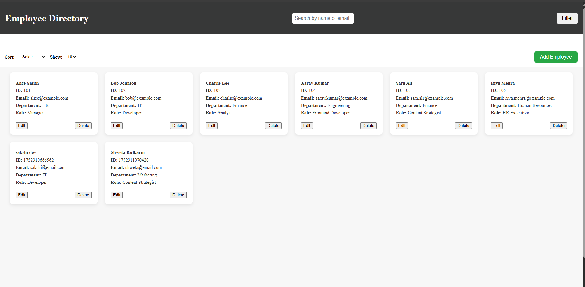
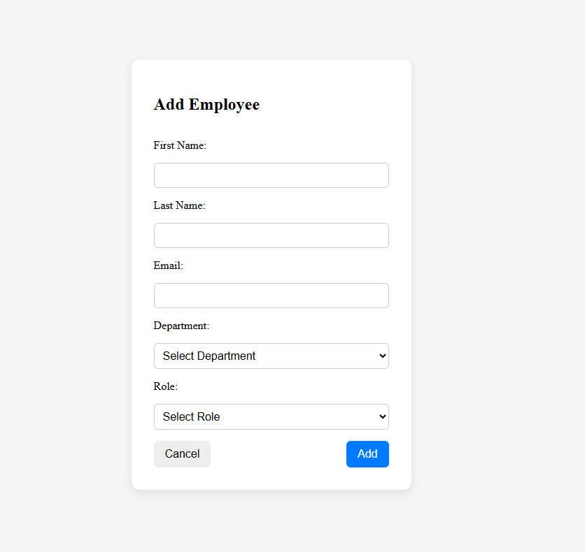
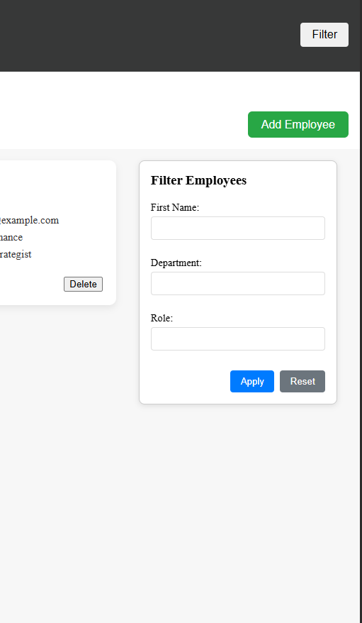

# EmployeeDirectory

A responsive and interactive Employee Directory web app built using HTML, CSS, JavaScript, and Freemarker templates.

## Features

- Dashboard page displaying employee cards (ID, Name, Email, Department, Role)
- Add/Edit employee form with validation
- Search employees by name or email
- Filter by First Name, Department, and Role
- Sort by First Name and Department
- Pagination (10, 25, 50 items per page)
- Responsive design for desktop, tablet, and mobile
- No backend required; uses mock data

## Setup & Run Instructions

1. Clone this repository:
   ```
   git clone https://github.com/yourusername/EmployeeDirectory.git
   ```
2. Open the folder in VS Code or your preferred IDE.
3. Open `index.html` (or `template.ftl` if using Freemarker) in your browser.
4. To add/edit employees, use the "Add Employee" button to open `manage_forms.html`.

## Project Structure

- `index.html` / `template.ftl`: Main dashboard
- `manage_forms.html`: Add/Edit employee form
- `js/employee_data.js`: Mock employee data
- `js/actions.js`: Handles UI actions (search, filter, sort, pagination)
- `js/form_handler.js`: Form validation and data updates
- `css/style.css`: Styles and responsive layout

## Screenshots

### 🖥️ Dashboard View


### ➕ Add Employee Form



### 📋 Filter Sidebar (UI)




## Reflection

**Challenges faced:**
- Ensuring full responsiveness across devices
- Handling dynamic filtering and sorting with vanilla JS
- Integrating Freemarker for template rendering

**Improvements for future:**
- Connect to a real backend for persistent data
- Add more advanced filtering and bulk actions
- Enhance UI/UX with animations and accessibility features

## License

© 2025 Bhargavi.
